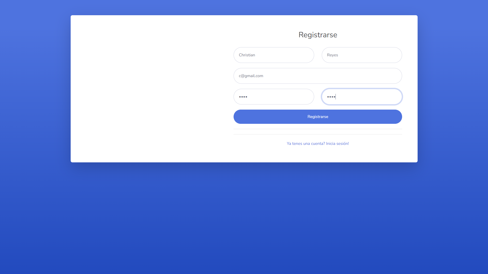
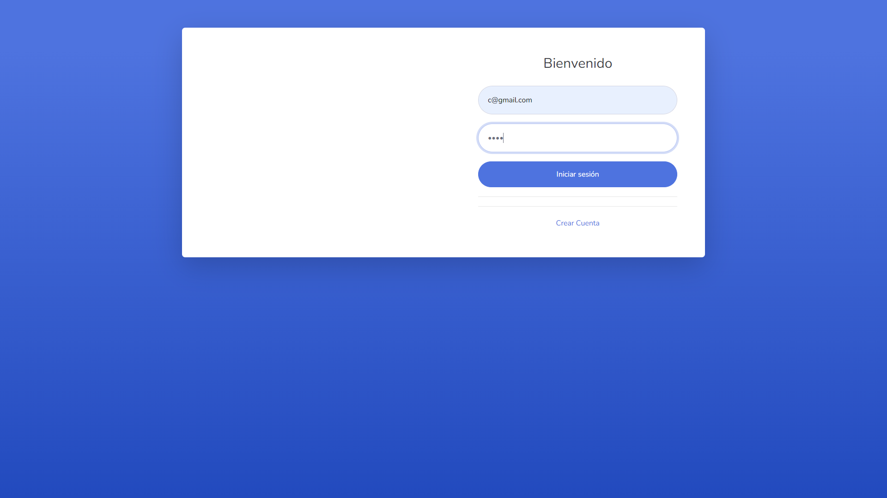
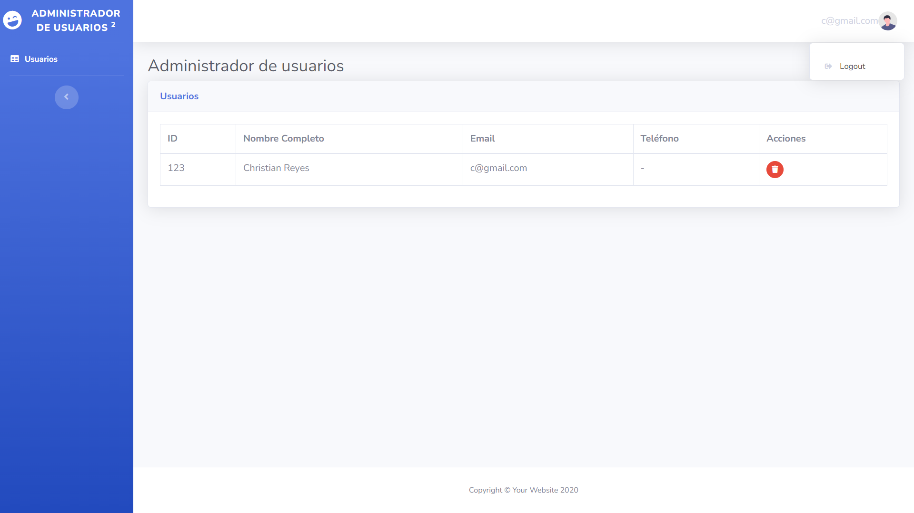

# JAVA: Proyecto de Administración de Usuarios

Este proyecto es una **aplicación web desarrollada en Java** para la administración de usuarios. Permite a los usuarios realizar diversas operaciones como crear cuentas, iniciar sesión, ver una lista de usuarios, eliminar usuarios y cerrar sesión. El sistema utiliza JWT (JSON Web Tokens) para la autenticación y autorización, y los tokens generados se almacenan en el `localStorage` del navegador para mantener la sesión activa y permitir el acceso a las funcionalidades protegidas.

## Características

- **Registro de Usuario**: Los usuarios pueden crear nuevas cuentas.
- **Inicio de Sesión**: Los usuarios pueden iniciar sesión en la aplicación.
- **Listado de Usuarios**: Los usuarios autenticados pueden ver una lista de todos los usuarios registrados.
- **Eliminación de Usuario**: Los usuarios pueden eliminar su cuenta o la cuenta de otros usuarios (según los permisos).
- **Cierre de Sesión**: Los usuarios pueden cerrar sesión en la aplicación.
- **Autenticación con JWT**: Se genera un token JWT al iniciar sesión, que se utiliza para autenticar y autorizar el acceso a las funciones protegidas. El token se almacena en `localStorage`.

## Herramientas y Tecnologías Utilizadas

- **Java 21**: Lenguaje de programación principal para el desarrollo del backend.
- **Spring Boot**: Framework para el desarrollo del backend.
- **Hibernate**: ORM para la gestión de la base de datos.
- **JPA (Java Persistence API)**: Para la manipulación de datos en la base de datos.
- **JWT (JSON Web Tokens)**: Para la autenticación y autorización de usuarios.
- **Maven**: Herramienta de gestión de proyectos y dependencias.
- **XAMPP con phpMyAdmin**: Utilizado para la creación y gestión de la base de datos durante el desarrollo.

## Requisitos para Ejecutar el Proyecto

1. **Base de Datos**: La base de datos debe llamarse `javafullstack`. Aunque la base de datos se creó utilizando XAMPP con phpMyAdmin, cualquier herramienta que permita gestionar bases de datos MySQL puede usarse para crear y gestionar la base de datos con el nombre especificado. Asegúrate de que la base de datos esté configurada en tu entorno.
2. **Entorno de Desarrollo**: Asegúrate de tener Java 21 y Maven instalados.
3. **Configuración de la Base de Datos**: Asegúrate de que la URL y las credenciales de la base de datos estén correctamente configuradas en el archivo de propiedades del proyecto.

## Flujo de la Aplicación

A continuación se muestra el flujo de la aplicación, incluyendo las pantallas correspondientes:

1. **Registro de Usuario**
    - **Imagen**: 
    - **URL**: [http://localhost:8080/registrar.html](http://localhost:8080/registrar.html)

2. **Inicio de Sesión**
    - **Imagen**: 
    - **URL**: [http://localhost:8080/login.html](http://localhost:8080/login.html)

3. **Lista de Usuarios**
    - **Imagen**: 
    - **URL**: [http://localhost:8080/usuarios.html](http://localhost:8080/usuarios.html)

4. **Cierre de Sesión**
    - **Imagen**: 
    - **Descripción**: El cierre de sesión se realiza a través de un menú desplegable en la página de usuarios (`usuarios.html`).

## Estado del Proyecto
Finalizado
